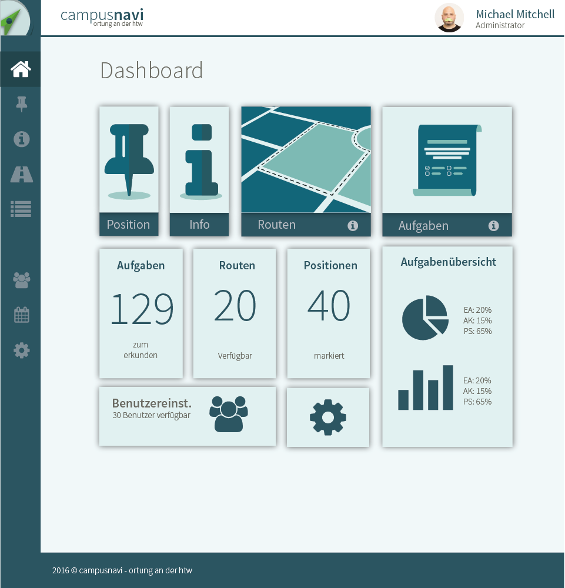

# campusnavi - ortung an der htw




## Features

* Responsive and Flexible Box Layout
* Based on the awesome [vue-admin][]
* Powered by [Vue][] & [Bulma][]
* Based on the awesome third-party [libraries](doc/dependencies.md)

## Build Setup

``` bash
# install dependencies
npm install

# serve with hot reload at localhost:8080
npm run dev

# build for production with minification
npm run build

# run unit tests
npm run unit

# run e2e tests
npm run e2e

# run all tests
npm test
```

For detailed explanation on how things work, checkout the [guide](http://vuejs-templates.github.io/webpack/) and [docs for vue-loader](http://vuejs.github.io/vue-loader).

## Guide for developers 

A guide for developers, how to work on this project, manage assets and develop new features can be found [here](doc/guide).
This guide is fully german.


[Vue]: http://vuejs.org
[Bulma]: http://bulma.io
[vue-admin]: https://github.com/fundon/vue-admin
